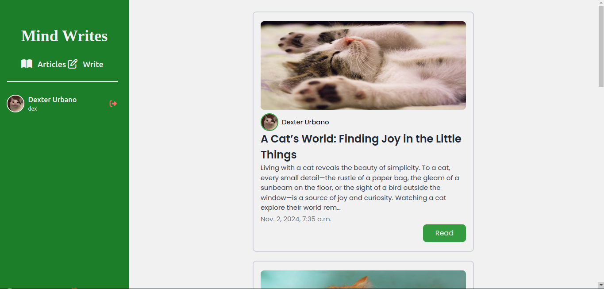

# Mind Writes

## About the Project

Mind Writes is a Django-based web application where users can share their thoughts and write articles on various topics. Users can engage with each other's posts through comments, fostering a collaborative environment for discussions and ideas. The app offers account management features, allowing users to create, update, and personalize their profiles to enhance their experience.
## Features
- Article Creation: Write and share articles on topics of interest
- Commenting: Engage with other users by commenting on their articles.
- User Accounts: Sign up, log in, and manage your profile.
## Built With
- Django
- Django Tailwind
